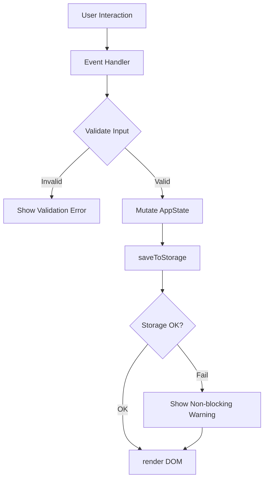

# Design Document: Expense & Budget Visualizer

## Overview

The Expense & Budget Visualizer is a fully client-side single-page web application built with plain HTML, CSS, and Vanilla JavaScript. It requires no build tools, no backend, and no JavaScript framework. All data is persisted in the browser's `localStorage` API. The app renders a pie chart via [Chart.js 4.5.0](https://cdnjs.cloudflare.com/ajax/libs/Chart.js/4.5.0/chart.min.js) loaded from a CDN.

The application is structured as a single HTML entry point (`index.html`) that loads one CSS file (`css/styles.css`) and one JavaScript file (`js/app.js`). All application logic — state management, DOM manipulation, storage I/O, chart rendering, validation, and theming — lives in `js/app.js`.

### Design Goals

- **Zero dependencies beyond Chart.js**: No npm, no bundler, no transpiler.
- **Immediate feedback**: All UI updates (balance, chart, list) happen synchronously within the same event handler tick, before the next user interaction.
- **Resilient storage**: Storage failures are surfaced as non-blocking warnings; the app continues to function in-memory.
- **Predictable state**: A single in-memory state object is the source of truth; the DOM is always derived from it.

---

## Architecture

The app follows a simple **unidirectional data flow** pattern without a framework:

```
User Action → Event Handler → Mutate State → Persist to Storage → Re-render DOM
```

All state lives in a single module-level object (`AppState`). Every user action calls a handler that:
1. Validates input (if applicable)
2. Mutates `AppState`
3. Calls `saveToStorage()` (non-blocking; warns on failure)
4. Calls `render()` to synchronously update the DOM and chart

There is no virtual DOM, no reactive bindings, and no async rendering pipeline. This keeps the implementation simple and guarantees that the DOM reflects state before the next user interaction.



### File Structure

```
index.html          ← Entry point; loads CSS and JS; contains all HTML markup
css/
  styles.css        ← All styles; light/dark theme via CSS custom properties
js/
  app.js            ← All application logic
```

Chart.js is loaded via CDN `<script>` tag in `index.html` before `app.js`.

---

## Components and Interfaces

### HTML Structure (index.html)

The page is divided into the following semantic regions:

| Region | Purpose |
|---|---|
| `<header>` | App title, balance display, theme toggle button |
| `#form-section` | Transaction input form (name, amount, category, date) + custom category input |
| `#filter-section` | Month/year filter selector + sort controls |
| `#chart-section` | Chart.js canvas + placeholder text |
| `#list-section` | Scrollable transaction list |
| `#spending-limit-section` | Per-category spending limit inputs |
| `#toast-container` | Non-blocking warning/error toasts |

### JavaScript Module Structure (js/app.js)

The single JS file is organized into clearly commented sections:

#### 1. State

```js
const AppState = {
  transactions: [],      // Transaction[]
  categories: [],        // string[] — default + custom
  spendingLimits: {},    // { [category: string]: number }
  theme: 'light',        // 'light' | 'dark'
  filter: null,          // { year: number, month: number } | null
  sort: 'default',       // 'default' | 'amount-asc' | 'amount-desc' | 'category-asc'
  chartInstance: null,   // Chart.js instance
};
```

#### 2. Storage Layer

| Function | Responsibility |
|---|---|
| `saveToStorage()` | Serializes `AppState` fields to `localStorage`; catches quota errors; shows toast on failure |
| `loadFromStorage()` | Reads and deserializes all persisted data; discards and warns on parse failure |

#### 3. Validation

| Function | Validates |
|---|---|
| `validateTransaction(name, amount, category, date)` | All transaction form fields |
| `validateAmount(value)` | Positive number, ≤ 999,999,999.99 |
| `validateCategoryLabel(label)` | Non-empty, ≤ 100 chars, case-insensitive uniqueness |
| `validateSpendingLimit(value)` | Positive number |

#### 4. State Mutations

| Function | Action |
|---|---|
| `addTransaction(name, amount, category, date)` | Appends to `AppState.transactions` |
| `deleteTransaction(id)` | Removes from `AppState.transactions` |
| `addCustomCategory(label)` | Appends to `AppState.categories` |
| `setSpendingLimit(category, limit)` | Sets `AppState.spendingLimits[category]` |
| `removeSpendingLimit(category)` | Deletes `AppState.spendingLimits[category]` |
| `setTheme(theme)` | Sets `AppState.theme` |
| `setFilter(year, month)` | Sets `AppState.filter` |
| `clearFilter()` | Sets `AppState.filter = null` |
| `setSort(sortKey)` | Sets `AppState.sort` |

#### 5. Derived Computations

| Function | Returns |
|---|---|
| `getFilteredTransactions()` | Transactions matching current filter (or all if no filter) |
| `getSortedTransactions(txns)` | Transactions sorted by current sort key (stable) |
| `computeBalance(txns)` | Sum of amounts, rounded to 2 decimal places |
| `computeCategoryTotals(txns)` | `{ [category]: number }` map |
| `isOverLimit(category, txns)` | `boolean` — whether category total ≥ spending limit |

#### 6. Rendering

| Function | Updates |
|---|---|
| `render()` | Calls all sub-renderers; single entry point |
| `renderBalance(txns)` | Updates balance display element |
| `renderTransactionList(txns)` | Rebuilds transaction list DOM |
| `renderChart(txns)` | Creates or updates Chart.js pie chart |
| `renderSpendingLimitWarnings(txns)` | Applies/removes highlight classes on list items and chart slices |
| `renderTheme()` | Toggles `data-theme` attribute on `<html>` |
| `renderFilterOptions()` | Populates year options based on existing transaction dates |

#### 7. Event Handlers

All event listeners are registered once on `DOMContentLoaded`. Delegation is used for the transaction list (single listener on the list container).

#### 8. Toast Notifications

```js
function showToast(message, type, autoDismissMs)
```

Renders a dismissible toast in `#toast-container`. `type` is `'warning'` or `'error'`. Auto-dismisses after `autoDismissMs` (default 5000ms for storage warnings).

#### 9. Initialization

```js
function init() {
  loadFromStorage();
  registerEventListeners();
  render();
}
document.addEventListener('DOMContentLoaded', init);
```

### CSS Architecture (css/styles.css)

Theming is implemented via CSS custom properties on the `:root` element, overridden by `[data-theme="dark"]` on `<html>`:

```css
:root {
  --color-bg: #ffffff;
  --color-surface: #f5f5f5;
  --color-text: #1a1a1a;
  --color-accent: #4a90e2;
  --color-danger: #e74c3c;
  --color-over-limit: #f39c12;
  /* ... */
}

[data-theme="dark"] {
  --color-bg: #1a1a2e;
  --color-surface: #16213e;
  --color-text: #e0e0e0;
  /* ... */
}
```

Theme switching is instant: toggling `data-theme` on `<html>` causes all CSS variables to update simultaneously, satisfying the 200ms requirement.

---

## Data Models

### Transaction

```js
{
  id: string,        // UUID v4 generated at creation time (crypto.randomUUID())
  name: string,      // Item name; non-empty
  amount: number,    // Positive float, ≤ 999,999,999.99
  category: string,  // Category label
  date: string,      // ISO 8601 date string: "YYYY-MM-DD"
}
```

### AppState (persisted fields)

The following fields are serialized to `localStorage` under distinct keys:

| localStorage key | Value | Type |
|---|---|---|
| `ebv_transactions` | JSON array of Transaction objects | `Transaction[]` |
| `ebv_categories` | JSON array of custom category strings | `string[]` |
| `ebv_spending_limits` | JSON object mapping category → limit | `{ [string]: number }` |
| `ebv_theme` | `"light"` or `"dark"` | `string` |

Default categories (e.g., `Food`, `Transport`, `Fun`, `Health`, `Other`) are hardcoded in `app.js` and merged with persisted custom categories on load. They are not stored in `localStorage`.

### Serialization Contract

Transactions are serialized as a JSON array. Each transaction object serializes all four user-visible fields (`name`, `amount`, `category`, `date`) plus the internal `id`. Deserialization validates that each entry has all required fields and that `amount` is a finite positive number. Any entry failing validation causes the entire dataset to be discarded (Requirement 6.4).

### Spending Limit

```js
{
  [category: string]: number  // positive float
}
```

### Monthly Filter

```js
{
  year: number,   // e.g. 2025
  month: number,  // 1–12
} | null
```

---

## Correctness Properties

*A property is a characteristic or behavior that should hold true across all valid executions of a system — essentially, a formal statement about what the system should do. Properties serve as the bridge between human-readable specifications and machine-verifiable correctness guarantees.*

### Property 1: Transaction serialization round-trip

*For any* valid array of transactions, serializing the array to JSON and then deserializing it should produce an array with the same Item Name, Amount, Category, and Date for every transaction in the same order.

**Validates: Requirements 6.5**

---

### Property 2: Valid transaction addition grows the list

*For any* transaction list and any valid transaction (non-empty name, positive amount ≤ 999,999,999.99, non-empty category, valid date), adding it should result in the transaction list length increasing by exactly one and the new transaction appearing in the list.

**Validates: Requirements 1.2, 2.3**

---

### Property 3: Invalid amount is always rejected

*For any* value that is non-positive, non-numeric, zero, or greater than 999,999,999.99, the validation function should return an error and the transaction list should remain unchanged.

**Validates: Requirements 1.4**

---

### Property 4: Balance equals sum of displayed transactions

*For any* set of transactions (filtered or unfiltered), the displayed balance should equal the arithmetic sum of all transaction amounts in that set, rounded to exactly 2 decimal places.

**Validates: Requirements 4.1, 4.3, 4.4, 8.3**

---

### Property 5: Category totals are consistent with transaction list

*For any* set of transactions, the sum of all per-category totals should equal the total balance, and each category total should equal the sum of amounts for transactions in that category.

**Validates: Requirements 5.1, 5.5**

---

### Property 6: Spending limit warning is applied if and only if over limit

*For any* category and any set of transactions, the over-limit visual highlight should be applied if and only if the sum of amounts for that category is greater than or equal to the configured spending limit for that category.

**Validates: Requirements 10.4, 10.5, 10.6, 10.7**

---

### Property 7: Custom category label uniqueness (case-insensitive)

*For any* existing set of category labels, attempting to add a new label that matches any existing label (case-insensitively) should be rejected, and the category list should remain unchanged.

**Validates: Requirements 7.4**

---

### Property 8: Monthly filter restricts transactions to selected month/year

*For any* transaction list and any selected month/year filter, every transaction in the filtered result should have a date within that calendar month and year, and no transaction outside that month/year should appear.

**Validates: Requirements 8.2, 8.3**

---

### Property 9: Sort stability — equal-value entries preserve insertion order

*For any* transaction list sorted by amount or category, when two transactions have equal sort values, the one with the earlier insertion order should appear before the one with the later insertion order.

**Validates: Requirements 9.3**

---

### Property 10: Whitespace-only category labels are rejected

*For any* string composed entirely of whitespace characters, attempting to create it as a custom category should be rejected (treated as empty), and the category list should remain unchanged.

**Validates: Requirements 7.1, 7.4**

---

## Error Handling

### Storage Failures

All `localStorage` writes are wrapped in `try/catch`. On failure:
- The in-memory `AppState` is **not** rolled back — the operation is considered successful for the current session.
- A non-blocking toast warning is shown (auto-dismisses after 5 seconds).
- The user can continue interacting normally.

### Corrupted Storage on Load

If `JSON.parse` throws or the parsed data fails schema validation on load:
- The corrupted key is removed from `localStorage`.
- `AppState` is initialized with empty defaults.
- A non-blocking toast warning is shown.

### Deletion Atomicity

Deletion updates both `AppState.transactions` and `localStorage` in the same synchronous operation. Since `localStorage.setItem` is synchronous, either both succeed or the catch block prevents the DOM from updating. If `setItem` throws, the transaction is not removed from `AppState` and the list is not re-rendered (Requirement 3.3).

### Confirmation Prompt

Transaction deletion requires `window.confirm()` confirmation before proceeding. This is a native browser dialog — no custom modal is needed, keeping the implementation minimal.

### Chart Placeholder

When `AppState.transactions` is empty (or the filtered set is empty), the Chart.js canvas is hidden and a `<p>` placeholder element is shown instead. The Chart.js instance is destroyed (`chart.destroy()`) when transitioning to the empty state to avoid memory leaks.

---

## Testing Strategy

### Unit Tests

Unit tests cover specific examples, edge cases, and error conditions for pure functions. Recommended framework: **Jest** (or any test runner that can import a plain JS module).

Key unit test areas:
- `validateAmount`: boundary values (0, 0.01, 999999999.99, 1000000000, negative, NaN, empty string)
- `validateCategoryLabel`: empty string, whitespace-only, 100-char limit, 101-char limit, case-insensitive duplicate
- `computeBalance`: empty array, single transaction, multiple transactions, floating-point edge cases
- `computeCategoryTotals`: transactions across multiple categories
- `getSortedTransactions`: amount ascending, amount descending, category alphabetical, stable sort with equal values
- `getFilteredTransactions`: filter matches, filter with no matches, no filter active
- `isOverLimit`: exactly at limit, one cent below, one cent above
- Storage deserialization: valid data, missing fields, invalid amount, malformed JSON

### Property-Based Tests

Property-based tests use **fast-check** (JavaScript PBT library) with a minimum of **100 iterations per property**.

Each test is tagged with a comment in the format:
`// Feature: expense-budget-visualizer, Property N: <property text>`

| Property | Test Description |
|---|---|
| Property 1 | Generate random valid transaction arrays; serialize then deserialize; assert structural equality |
| Property 2 | Generate random valid transaction + existing list; add transaction; assert list length +1 and contains new entry |
| Property 3 | Generate invalid amount values (≤0, NaN, >999999999.99, non-numeric strings); assert validation rejects all |
| Property 4 | Generate random transaction sets; assert `computeBalance` equals sum of amounts rounded to 2dp |
| Property 5 | Generate random transaction sets; assert sum of category totals equals total balance |
| Property 6 | Generate random category totals and spending limits; assert highlight applied iff total ≥ limit |
| Property 7 | Generate random category lists; attempt to add duplicate (with random casing); assert rejection |
| Property 8 | Generate random transaction lists with varied dates; apply random month/year filter; assert all results within filter |
| Property 9 | Generate random transaction lists with duplicate amounts/categories; sort; assert stable ordering |
| Property 10 | Generate whitespace-only strings; attempt to add as category; assert rejection |

### Integration / Smoke Tests

These are not property-based tests. They verify wiring and browser behavior:
- App loads without JS errors in all 4 target browsers
- Chart.js CDN script loads and `Chart` global is available
- `localStorage` read/write cycle works in a real browser context
- Theme toggle applies `data-theme` attribute and persists across reload
- Page load time under 2 seconds (measured via browser DevTools / Lighthouse)
